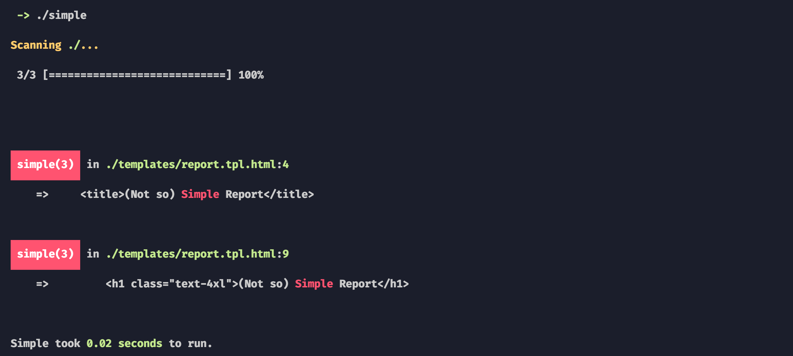

# (Not so) ~~Simple~~


[](https://github.styleci.io/repos/238022831)
[](https://coveralls.io/github/m50/simple?branch=trunk)

[](https://packagist.org/packages/m50/simple)
[](https://packagist.org/packages/m50/simple)
[](https://packagist.org/packages/m50/simple)

The documentation verification tool to make sure that nothing is considered easy or simple.

Run *Simple* in your CI process on your documentation to make sure you don't put
out any documentation that is condescending or unhelpful to learners. Everywhere
that *Simple* finds any of the problematic words, it may be a perfect case to
provide more detailed documentation.

It's like a unit test for your documentation.

## Usage

To use simple, run it from the command line providing the directory the documentation files reside in. Example:

To generate the default configuration file, run init:

```sh
simple init
```

Then you can just run it:

```sh
simple
```



or specify a specific directory:

```sh
simple -f./docs/
```

To get a full list of options and flags, run the help command:

```sh
simple help
```

### In CI

In CI, it is recommended to run it like so:

```sh
simple --no-color --no-progress-bar --report-file=report.junit.xml
```

This will force a junit report to be generated, for use in your CI reporting system.

## Installation

Simple can either be installed as an executable PHAR, or as a composer dependency.

Alternatively, it can be used with docker for CI builds or locally.

### Docker:

The [docker image](https://hub.docker.com/r/marisa50/simple) is: `marisa50/simple`.

To run simple on your docs:

```sh
docker run --rm --interactive --tty --volume $PWD:/app m50/simple:latest
```

### Phar:

```sh
wget -O simple.phar $SIMPLE_DOWNLOAD_PATH
chmod 755 simple.phar
mv simple.phar /usr/local/bin/simple
```

### Composer

```sh
composer global require m50/simple
```
